# KiCAD PCB Tutorial
 
There are many PCB CAD tools. Some examples include: Altium, Allegro, PADS, Eagle, Diptrace and KiCAD. The principles behind PCB CAD tools are generally similar. Each tool has its own design choices, with these come advantages and disadvantages. Once you learn your first PCB CAD tool learning more should not be as difficult. Altium, Allegro and PADS are commercial tools. They cost several 1000 dollars a seat. Eagle and Diptrace are freemium model software. Both support 2-layer boards with some restrictions for free. KiCAD is the most mature open source software (OSS) PCB CAD tool available presently. 

This tutorial will be based on KiCAD and will teach the basics of PCB design. As OSS you will always have KiCAD available to you. It has no restrictions on its use for commercial designs. In addition it is improving steadily with significant contributions from CERN. 

**In this tutorial we will learn how to: make a schematic, schematic symbol, footprint and PCB layout. This makes this tutorial longer than it might otherwise be but it also means you will have all of the basic skills of PCB design.** 

In this document actions to take will be written in *italics*. Menus will levels will be written as Menu -> sub-menu -> item. 

## Design and part selection:

In this tutorial we will be create a simple adjustable low drop out regulator (LDO) based power supply with power supplied by a USB port. To do this we must first select the parts required. 

Part selection is an important skill to master. Digi-key electronics [digikey.com](http://www.digikey.com) has over 19,000 LDOs to choose from. It can be hard to know where to begin. Luckily the parametric search parameters available help narrow the scope of the choice quickly if you have some basic specifications in mind. There are less than 3,000 positive adjustable LDOs in stock. Selecting for output currents greater than 500 mA reduces the count to less than 2,000. Selecting only LDOs in a TO-263 and variants package reduces the number to under 400. Restricting the drop out voltage (input to output loss required for regulation) to less than 0.4 volts reduces the number to less than 200. At this point in the process it becomes necessary to read datasheets. 

Digi-key is just one of many electronics parts distributors. Mouser, Newark, Arrow and Avnet are its most direct competitors in the US. [octopart.com](http://octorpart.com) is a useful metasearch of distributors to find the lowest cost source.
LDOs are feedback based devices, as such there are stability criteria for them. Stability of an LDO is normally dependent on the properties of the capacitors used in conjunction with the LDO. Specifically the size of the capacitor and the equivalent series resistance (ESR, which models a non-ideality of a capacitor) are most relevant. Often this restricts the type of capacitor we can use with the LDO. Older LDOs required tantalum capacitors. Newer LDO designs are able to use ceramic capacitors. Other capacitor types include aluminum electrolytic, and polymer based dielectric capacitors. Each type of capacitor has advantages and disadvantages. Here we will use ceramic capacitors only. They are not generally polarized, are small and inexpensive. 

From our 200 LDO choices remaining we select a Texas Instruments [TL1963 LDO](http://www.ti.com/lit/ds/symlink/tl1963a.pdf). This part is also available from Linear Technology as LT1963. This is an example of second sourcing, and is wise for design longevity. If one company stops making the part or has a supply disruption, there is a second option available. Another reason we selected the TL1963 is that it is a low noise LDO making it appropriate for many analog applications not just digital circuits!

We will implement the simplified schematic on the first page of the [datasheet](http://www.ti.com/lit/ds/symlink/tl1963a.pdf) for this tutorial, supplying Vin from a USB plug and making Vout available on a 0.1 inch header that can plugged into a breadboard. 

In section 10.2 of the datasheet we are given the formula for the output voltage:
$$V_{out}=1.21V (1+R_2/R_1 )+I_{adj} R_2$$

Meanwhile Figure 30 (reproduced below) gives a particular application of the formula for a 2.5 V output. 

 
We wish to create an output ranging from as close to 0 as possible to as close to our input voltage as reasonable. Our USB power source is 5 V, and the dropout voltage of this regulator is nominally 340 mV. Regulation between 1.21 V and 4.6 V is therefore possible. To enable user adjustable operation we must replace R1 or R2 with an adjustable resistor: a potentiometer, also called a pot. 
We will replace R2 with the pot. 10 Kohm pots are common. Taking 4.5 volts to be the maximum output voltage this requires a 3.68 Kohm resistor for R1. Replacing R1 with a pot would be unwise as ADJ must remain at 1.21 V and it could be shorted to GND by the user if a pot replaced it. 
We will select a 12 turn trimmer potentiometer for R2 (Part: [3269W-1-103GLF](http://www.bourns.com/docs/Product-Datasheets/3269.pdf)), this will allow fine adjustment of the output voltage. 

For R1 we will choose a standard 3.65 kohm resistor in a 0805 surface mount package (Part: ERJ-6ENF3651V).

For the capacitors we will select 10 µF 0805 capacitors with a temperature X5R temperature coefficient. (Part: GRM21BR61C106KE15K; ceramics capacitors use a variety of types of ceramics and they have different properties, X5R is a class II ceramic and a good middle of the road choice if NPO is not affordable or available). 

Finally we need to select a USB connector. For this we will select a standard USB-B type connector. Although microUSB is now the most common the USB-B will be easier for you to solder if you are just learning the process for the first time. Soldering a microUSB and other fine pitch parts is not difficult with some practice! The USB connector we have picked out is: [USB-B1HSB6](http://www.on-shore.com/sites/default/files/manuals/usb-b1hsxx.pdf).

Part selection is based on engineering judgement. Some of the proceeding reasoning might be opaque. The prose have been kept short to not drag down the exposition of this tutorial, however if you are curious to learn more about any of the trade-offs in the parts selected above just ask your professor. 

## Preliminaries:
Now that we have finished our part selections we can get to work making the PCB to place them on! 

If you have not already obtain a copy of KiCAD fromm: [http://kicad-pcb.org/](http://kicad-pcb.org/). This tutorial matches version 4.0 and was installed with the default options.

KiCAD is available for Linux, Windows, and OS X. This tutorial will be using the appearance of the windows version but most will be similar. “Folder” will be used as a synonym for directory.

## Create a new project:

*Create a folder for your project named tutorial*

*Launch KiCAD from the start menu*

*Create a new project: **File->New Project->New Project**, navigate to the folder you created and set the file name of your project to tutorial; click save*

KiCAD is a collection of sub-programs their icons are shown below:

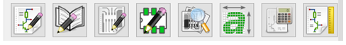

From left to right the first 5 programs are:
  * eeSchema – a schematic capture program
  *	Library Editor – a program to create schematic symbols
  * PCBnew – a PCB layout tool
  * Footprint Editor – a program to create PCB footprints
  * Gerbview – a program to inspect Gerber files

The last 3 are utilities programs which will not be covered at all in this tutorial. **Placing your mouse over the icon in KiCAD always gives a tooltip of which the icon does.** 

## Making a schematic:
To create a schematic for this project *launch eeSchema from the main KiCAD window.*

You will have a blank sheet. Schematics in eeSchema can be hierarchical if you have a complex circuit to build but in this tutorial we will fit everything onto a single sheet. 
To draw the schematic we must place the required components onto the sheet. 

*Place->Component (Shift+A)*

Notice both the shortcut (Shift+A) and the icon. The icon is available in the toolbar at the right hand side of the sheet. The keyboard shortcut can also be used. 

*Click somewhere on the sheet.*

You should get the choose component dialog box:
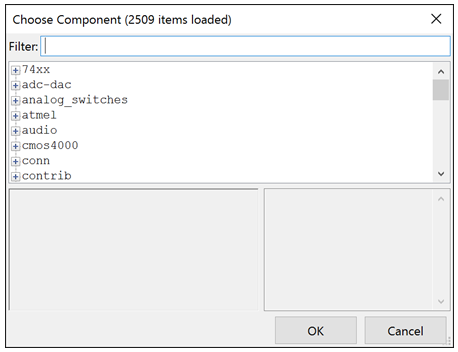
 
You can use this to browse for the component you wish to place. 

*Look under “conn” and find USB_B and click OK*

Your cursor will now have the component attached to it. *Left click somewhere on the sheet to drop component.* The object on the sheet is called the **symbol** for the component. 

Now we will add the capacitors. Rather than searching for them in the list we can type the name.

*Left click on the sheet, in filter type “C”, the first entry that appears will be an unpolarized capacitor, what we need. Click OK.*

*Place the capacitor on the sheet by left clicking the sheet. Then place a second capacitor on the sheet.*

Notice that the place component dialog remembered the last choice which saves you some typing or hunting in the list. Next we need a resistor.

*Place a resistor “R” on the sheet.*

We also need a potentiometer, the LDO and a 2 pin header with 0.1 inch pitch.

*Place a potentiometer “POT” on the sheet.*

*In the “conn” list find CONN that is listed with the comment [Connector 01x02]*

With these in place all we need is the LDO. 

The maintainers of KiCAD do not have every part in their libraries. They do have some regulators, however we have purposely selected one that will require us to do another essential task: making a symbol.

## Making a symbol
Symbols are representations of parts for schematic capture. They associate the number of a pin on a package with the purpose of that pin using a friendly name or label. Some symbols are iconic and standardized others are simply black boxes with pin numbers and labels.

The built-in tool to make symbols is the library editor. This tool lets you draw the symbol on a pin by pin basis.
Because KiCAD is modular and everything is just a file, other tools exist that can greatly speed up creating library symbols for KiCAD.

If you are going to make a lot of symbols [KiPart](https://kipart.readthedocs.io/en/latest/) is a python based script for making complex symbols. It was written by a FPGA board designer. FPGAs have 100s of pins so making symbols by hand is error prone and tedious. 

Another tool for making KiCAD symbols is available on the web: 
[http://kicad.rohrbacher.net/quicklib.php](http://kicad.rohrbacher.net/quicklib.php)

This tool is great as its name implies for quickly making symbols. The default of this tool is to create symbols that look like the physical part. When there are a large number of pins connected to the same place but not next to each other this can be non-optimal. As you progress in PCB design you will find this can be a major drawback and learn other ways of making symbols. When you have a part with a small number of pins having the symbol look like the physical part makes the schematic look more like the circuit/PCB which can be good. 

For this tutorial we will only use quicklib. 
*Go to:[http://kicad.rohrbacher.net/quicklib.php](http://kicad.rohrbacher.net/quicklib.php)*

*Input for the component name: LDO-TL1963-TO263-5*

This name is instructive what the part is and clarifies what the package is because it comes in several packages.
*In N type 5, and select SIL, then click assign pins*

The datasheet shows the pinout in section 7:
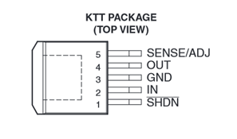
 
*Replace PIN1, PIN2, etc with the names shown above. Use ADJ for pin 5.*

*For pin 1 in the format column click on the inversion bubble style.*

*For the type select Power Input for IN, GND, select Power Output for OUT. Leave SHDN and ADJ as inputs.*

The input type is used for automatic design checking. If all your symbols use it correctly you can look for mistakes in a schematic with these constrains. For instance two Power Outputs pins connected to the same node would produce a warning. 

When you are done it should look like this:
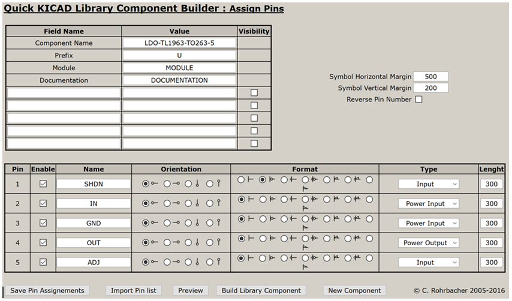
 
*Create a folder somewhere convenient called “KiCAD libraries”*

*In the web tool click “Build Library Component”; save the file.*

In most modern browsers this will end up in the downloads folder: the file should be called: LDO-TL1963-TO263-5.lib

*Move this file to your KiCad libraries folder you created and rename the file mySymbols.lib*

As you get more symbols it would be wise to segment the libraries you create into parts of different classes. For now we have few enough that one library is sufficient. 

*Open mySymbols.lib in a text editor.*

You will see the code that the script generated. Most of the code are coordinates of the symbol and the pin numbers and names. 

Comments are started with #

**To add more symbols to your library just download the symbol file as you just did and then copy and paste the code from the first # to the ENDDEF statement into this library file. Having a single library file will save you effort of adding many libraries to your project!**

One thing that the online script does not do is add code to filter the footprints (physically what the part looks like on the PCB).  We can add this by hand in the text file.

*Directly above draw insert:*
$FPLIST
 TO-263-5Lead
$ENDFPLIST

*Remove the word MODULE from F2’s quotes (this field is deprecated).*

*Save the file.*

If you felt that was rather complex, on the one hand it was. On the other hand it really is not hard to do: Go online type in the pins, click a button, copy code from one file into another and save. You do not have to add a filter list to the part at all, that just saves you effort when you are going to use this part frequently. Making symbols and footprints is always the most tedious part of PCB design. It gets easier with practice and once you have a set of parts you commonly use the frequency decreases. 

## Finishing the schematic
We now need to add the library to our project.

*Go back to eeSchema*

*Click Preferences->Component Libraries*

*Click on Add then browse to the library we just created, click open then OK*

*Place a component, find mySymbols in the list. Look there is your shiny new symbol! Place it on the sheet.*

*Press the escape key to exit the place component mode.*

*Hover over a part and click M to move, click R to rotate.*

You may get prompts for what object you wish to move or rotate. Field values are the labels on the symbols. A component is an instance of a symbol. 

*Rearrange the components so that it looks something like this:*
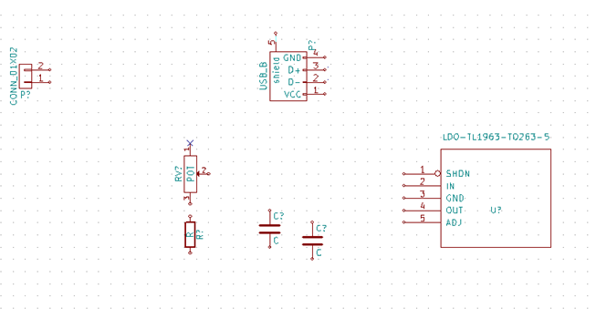
 
Now we will wire the schematic together. 

First we will place No Connection flags on the pins we will not use.

*Place-> No Connect Flag (shift-Q)*

*Click on pin 1 of the POT, pin 2, 3, and 5 of the USB_B*

*Press escape*

The schematic we are trying to make is:

 
Where we have replaced R2 with pins 2 and 3 of the POT and we have replaced Vin with pins 1 and 4 of the USB_B connector.

*Wire the parts other than CONN_01x02 using Place->Wire (shift-W)*

Left clicking on a pin starts a wire, left clicking on another pin ends the wire. Left clicking elsewhere adds a turning point to the wire. Double clicking ends a wire even if it is not on a pin. A node bubble will appear where crossing wires are connected and not on a pin. Two crossing wires without a node bubble are not connected. 

**It should look something like this:**
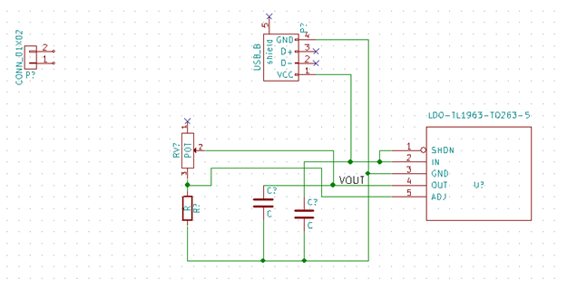
 
It is a little bit messy and we have not connected the CONN_01x02 yet. 

Wires are just a visual way of connecting two nodes so that the schematic tool can create the netlist of what is connected to what. Another way to tell the schematic tool two nodes are connected is with a label. 

*Place-> Label (shift-L)*

*Click near the CONN_01x02 and type VOUT for the text then click OK, left on pin 2 of CONN_01x02*

*Next copy the label by hovering over it and pressing C, place the label on the wire leading from “OUT” in your schematic.*

**It should look something like this:**
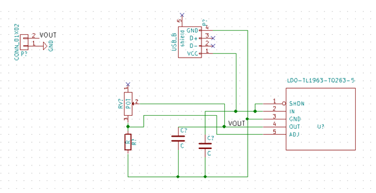
 
If you see a square box for the label it is not connected to anything. 

Our last step is to place a GND label. These are just labels like the one we just created they just have standard names. 

*Place -> Power Port*

*Left click on the schematic, type GND into filter and then OK*

*Left click to place the GND on the wire from GND*

*Use “C” to copy the GND and then R to rotate it, left click on pin 1 of CONN_01x02 to place the GND.*

**The schematic should now look something like this:**
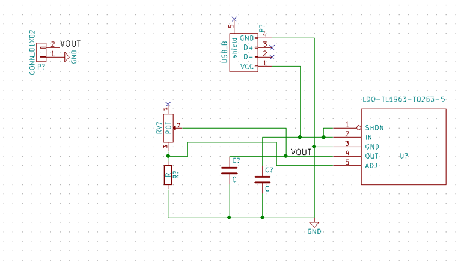
 
## Last steps to finish the schematic
We are all done placing and wiring. We now just have to create the netlist and tell the PCB layout tool what footprints to use for our symbols. 

You may have noticed that the symbols we placed have labels like U? and P? on them. The ? stands for an unknown number. You can add these by hand if you want to give them specific numbers for some reason. There is an automatic way to do it though.

*Tools-> Annotate Schematic*

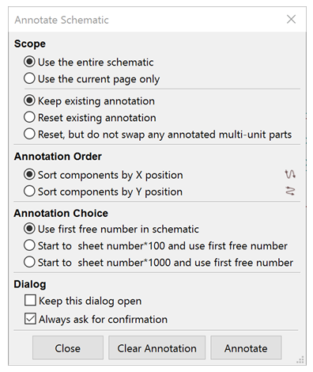
 
The defaults shown above are fine for our purposes.

*Click Annotate, then OK*

Now we create the netlist

*Tools -> Generate Netlist File*

The netlist creation window for PCBnew will appear

*Click on Generate, and save*

The default name will match the project and the save location will be the project folder. These are the best choices.

*Finally, File -> Save Schematic Project (ctrl-s)*

The schematic tool has done its job: producing a netlist for the circuit we wanted. Our next step is to tell the CAD tool what the parts look like by assigning the symbols footprints.

## Assigning and making footprints:
Most of the footprints we will need are built into KiCAD because we wisely chose parts with standard footprints. We could have chosen a potentiometer with a standard footprint as well but we intentionally did not to allow this tutorial to including making a footprint. This is an essential skill just like making a symbol.

*In the main KiCAD window click on Footprint Editor*

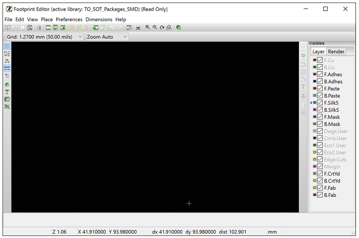

You may get some warnings but you can just click through them. This should bring up the footprint editor:
 
*File -> Set active library, choose TO_SOT_Packages_SMD*

We have picked this library because it will have similar footprints in it to the one we need to make.

The first page of our potentiometer [datasheet](http://www.bourns.com/docs/Product-Datasheets/3269.pdf). Shows us the footprint we need to make, we have a W type potentiometer:

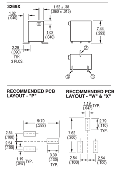
 
It is helpful to find a package/footprint that looks similar to what you want to create but it is not essential. 

*File -> Load Footprint -> Load Footprint from current library, click browse*

Looking through the footprints top to bottom in the second column we see that SOT-23 is not too different than what we need to make. 

*Double click SOT-23*

Now we need to create a new library.

*File -> Save Footprint in new library, browse to the KiCAD library folder you created, click OK*

Now we need to add the library to this project. To do this we will use the library manager.

*Preferences -> Footprint Library Manager*

The manager will appear:

 
*Click on the Project Specific Libraries tab*

*Click Append Library, give the library the nickname tutorial and input the path to the library you just saved*

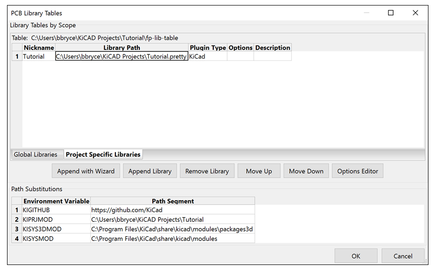

In windows one way to get the path easily is to browse to the folder then click the address bar to show the full path, you can then copy the path to the clipboard (ctrl-c). The path will end in .pretty.

*Click OK*

Now we need to modify our footprint to match the datasheet.

*File -> Set Active Library, double click on tutorial in the list*

*File -> Load Footprint -> Load Footprint from current library -> List all, double click on SOT-23*

*Use the button labeled IN to switch to inches, and change the Grid with the drop down to 5 mil*

*Right click pad 3*

All possible options we might need are listed

*Click edit (E)*

We will now edit the location and pin number of the pad to match the datasheet image for the W layout.

*Change the pad number to 2, change position Y to -0.095, Size X to 0.047, and Size Y to 0.11, click ok*

*Mouse over pad 1 and press e, change positon X to -0.1, position Y to 0.095, Size X to 0.047, and Size Y to 0.11, click ok*

*Mouse over the remaining small pad labeled 2 and press e, change the pad number to 3, change positon X to 0.1, position Y to 0.095, Size X to 0.047, and Size Y to 0.11, click ok*

It is important to notice face up from face down when making footprints. The drawing of the pin numbers is with the part facing up, while those same pins will be placed face down when soldered. So our footprint is now correct.

All that remains is to change the silkscreen and module name so that they look nice and match the part. You should currently have something that looks like this:

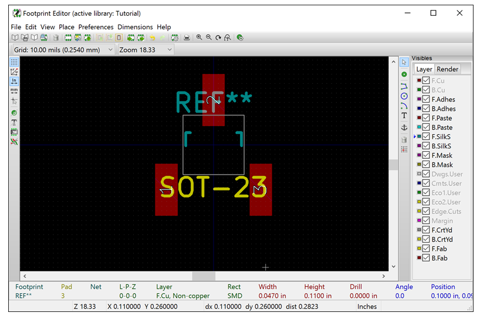
 
The silkscreen is the text that will appear printed on the PCB, typically in white. 

*Right click on the SOT-23 text and click edit, change the value to TPOT*

*Mouse over the gray lines (graphic lines) and tap the delete key to remove them*

*Move REF** (M key or right click) to the center of the part so that it does not overlay pad 2*

*Change the grid to 25 mil*

*Check that in the layer toolbox at right “F-silk” is selected as in the image above*

*Place-> Line or polygon*

*Draw a box around the part close to the pads. Click once to lay a new segment, double click to end drawing*

It should look like this:

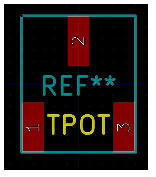
 
*File-> Save Footprint in Active Library, in the save footprint dialog box change Name to TPOT and click OK*

We are now done making our part! You do not have to setup the libraries every time you have to do this again if you make them global. In this tutorial we have not done that because this is your first run through and you might want to do things differently later. It was a lot of steps but again it goes quicker once you have things set up and have done it a few times. All it amounts to is creating some pads in the right spots and drawing some boxes and text in a CAD tool. 

*Close the footprint editor.*

## Assigning footprints
We have all the footprints we need so we can now assign the symbols footprints!

*Return to eeSchema, open it again if you closed it.*

*Tools-> Assign Components Footprints*

If you get a warning about legacy footprints, click no. 
The program on the screen is Cvpcb, it should look like this:

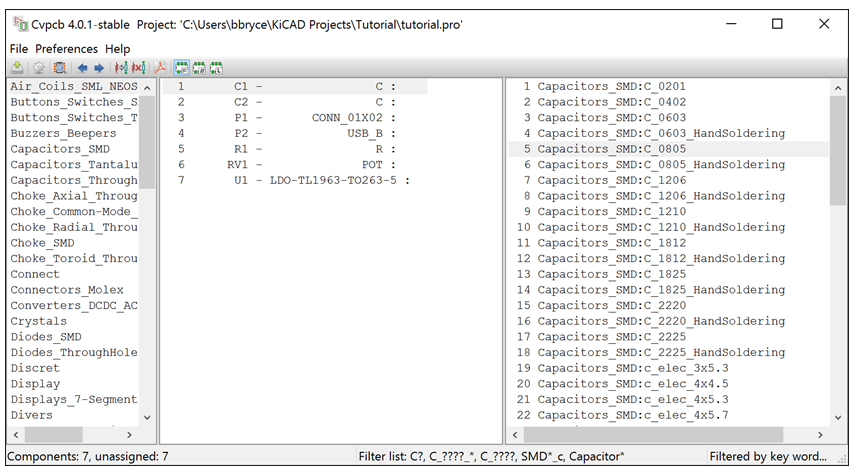
 
Notice the 3rd icon from the right is depressed. It indicates the list shown at right is filtered. This is normally a good thing but occasionally the footprint you want will not be listed. If the symbol does not have a FPLIST then all the footprints will be shown. In that case it can be helpful to filter by pin number or by library! (These are # and L buttons).

We want to assign 0805 capacitor footprints to the Cs and 0805 footprint highlighted in the image above. Do not use the HandSoldering variants. 

*Double click the Capacitors_SMD:C_0805 footprint to assign it to C1 then again to assign it to C2*

*Assign Pin_Headers:Pin_Header_stright_1x02 to CONN_01x02*

*Assign Connect:USB_B to USB_B*

*Assign Resistor:SMD:R_0805 to R*

*Click on U1 in the middle column then assign TO_SOT_Packages_SMD:TO-263-5Lead to U1*

*Click on RV1, then click on the IC icon with the L at the far right of the toolbar*

The list is now filtered by library

*Click on Tutorial in the left hand pane, then double click TPOT in the right hand pane*

It should look like this:

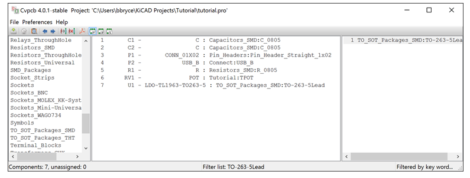
 
*File->Save Edits*

*Close Cvpcb*

We are done assigning parts! We have to regenerate the netlist file to have these change included in the file for use with PCB layout tool. The earlier netlist generation was not actually needed, but does not hurt.

*Tools -> Generate Netlist File, use the defaults and save*

*Save your schematic again and then close eeSchema*

## PCB Layout:

Our last task is to create the PCB itself.

A PCB is composed of layers. Each copper conductive layer of a PCB is separated from its neighbors by an insulating dielectric layer. This dielectric is typically either ceramic or fiberglass. A two layer board has 2 copper layers and 1 dielectric layer. A 4 layer board has 4 copper layers and 3 dielectric layers. The dielectric layers and not referenced in counts nor are they numbered. From here forward “layer” will mean a copper layer. 

Each layer on a PCB contains pads, traces, and fills. Layers on a PCB are connected to one another with conductive vertical elements called VIAs.

A pad is an exposed area of metal onto which a pin of a component may be soldered. A footprint for a component contains one or more pads. The PCB layout program we will use knows which pads should be connected to which other pads because of the netlist that the schematic capture program has generated. 

Traces are lengths of copper inside a layer that perform the function of connecting one pad to another. The CAD software will obey design rules to prevent traces from being placed on the PCB too close to one another to be manufactured, or inadvertently crossing causing unwanted connections. 

VIAs are holes through multiple layers that are plated with metal to allow one trace to connect to another trace on another layer of the board. 

Fills are typically unexposed metal in areas of the board that normal traces do not need. A common use for a fill is to create a ground plane. 

Most PCBs also have a solder mask. This is a layer of polymer over the top and bottom copper layers that solder will not wet (stick to).

Most PCBs also have writing on them, which is referred to as the silkscreen. This is named after a common printing process. They now are printed on boards with many techniques. 

**Good PCB design requires awareness of the signals carried on the copper traces.** Ideal practice for PCB design is to consider the full electrodynamics of all the electrical signals on the board and their interactions. This can take many forms in some cases finite element modeling (FEM) of Maxwell’s equations could even be required. Generally though PCB designers follow design rules and manufacturer recommendations in datasheets when laying out a PCB. Understanding the physics behind the rules however is helpful to know when it is okay to break the rules!
Here are some simple rules to remember and the physics behind them (where applicable) that will help you make better PCBs:
 * Shorter traces are better traces. Traces have resistance, inductance and capacitance per unit length. Shorter traces reduce propagation time and losses. In most cases shorter is therefore better. It can be helpful to make the most critical traces the shortest. Even when you do not have a controlled impedance board sometimes you can make traces short enough they will not matter and you will not have to consider matching lengths of traces either.
 * Consider not only where the signal goes but how it comes back. All current flows in some loop. That loop must return to a power supply somewhere. Therefore you must consider that return path for any signal as well. In general keeping loop areas small is better as it reduces inductive coupling.
 * Keep bypass capacitors very close to the IC power pins. Though this goes with the first point it is worth noting that if the inductance of a trace leading to a bypass capacitor is too large then that capacitor has no purpose. 
 * Minimize the number of VIAs you need on signal traces. VIAs are more failure prone and have a larger resistance than a regular trace segment. Careful arrangement of components in the early part of PCB layout can help reduce the number needed. In general a more compact board will have more VIAs though so it will be a tradeoff of trace length for number of VIAs in most cases. 
 * Use a ground plane and connect that ground plane with many VIAs to any other filled areas that are also ground. More VIAs will lower the resistance to the ground plane and reduce parasitic effects. 
 * Route your most important traces first. This is often the highest speed traces or the most susceptible to noise or interference. 

The task remaining to us is to use the netlist information we created with the schematic capture tools and create a PCB. We will import the footprint and connection data from the netlist we have worked hard to create. We then will move the footprints around and draw traces and VIAs on the PCB to connect the nets together. The software will prevent us from shorting this together or connecting parts to the wrong places!

*From the KiCAD main window launch PCBnew, use the icon or Tools-> Run PCBnew*

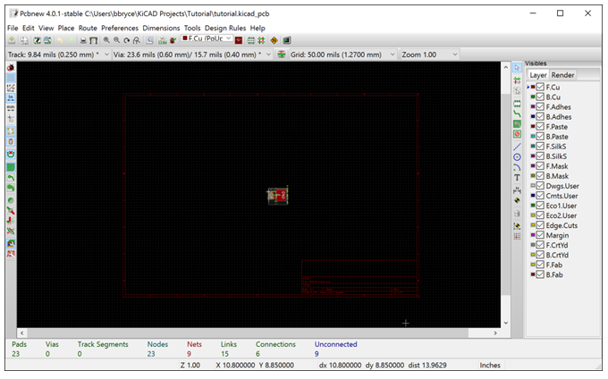
 
Once PCBnew is started:

*Tools->Netlist, then click the read current netlist button and then close*

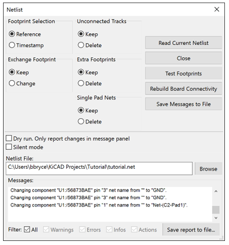
 
You will get many messages about renaming nets.

At this point your parts will all be in a pile. You can use your pointing device’s method of scrolling to zoom in and out.

*Click on the 4th icon from the right in the top toolbar (Mode footprint):* 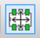

This sets the mode into one that defaults to moving footprints around and has some extra options for moving them as well. 

*Make sure you are on the default canvas rendering. View -> Switch Canvas to Default (F9).*

*Right click anywhere in the black area, Global spread and place -> Spread out all footprints*

You will have something like this now:
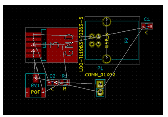
 
The white lines running between the red pads are called airlines, they indicate the connections we must still make to complete the connectivity described by the netlist. The collective set of airlines is called the ratsnest. This is just a reference to it looking very messy. 

Our goal at this point is to make the ratsnest look as neat as possible by moving and rotating the parts. In general it is better if fewer airlines cross each other. You can use M for move and R for rotate. You can rotate while moving.

*Set the Grid to 25 mils with the dropdown in the toolbar at the top of the screen.*

*Move and rotate the components so that no parts are overlapping and the ratsnest looks less messy. Do this while keeping the area the components take up on the screen small.*

This step is one of the most important of PCB design. Poor locations of parts will make a bad board. You also must consider if you can solder the parts. Placing parts too close to each other can make that job harder, but makes traces better and lowers the cost of the board!

I ended up with this for my footprint layout:
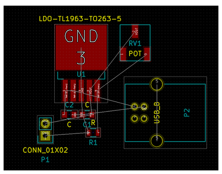
 
Before we start putting traces onto the board we must do two things: define the design rules and define the extent of the board.

*Check that the “In” button is depressed for inches in the toolbar at the left of the program (4th icon from the top)*

*Design Rules -> Design Rules*

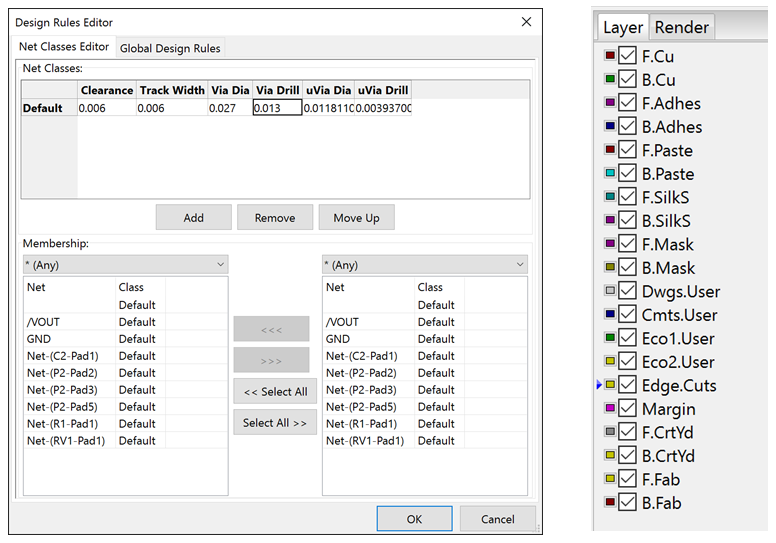
 
*Fill in 0.006 for Clearance and Track Width. Fill in 0.027 for Via Dia and 0.013 for Via Drill.*

*On the Global Design Rules tab fill in 0.006 for Minimum track width. Click OK.*

These parameters match the manufacturing specification of OSHPark which an inexpensive source of PCBs. They are fairly common for 6 mil clearance boards. 

*Leave footprint mode by clicking on*  *again.*

*Change the grid to 50 mils.*

We will now draw the board edge. The panel at the right hand side of side of PCBnew is the layer pallet. It is shown above.

*Select Edge.Cuts, then draw a box around the parts using Place->Graphic Line*

Remember that one click adds a segment, two clicks or escape ends the tool. 

The silkscreen of parts normally indicates their extent. Because there is no harm in letting the USB connector extend beyond the edge of this board I have defined the board extents to cut part of the silk screen off, this will make the board smaller and save money:

 
Now we may route the board.

There is an autorouter built into KiCAD and there is also the ability to export the netlist as a DSN file. This allows the use of an external router. 

We will not use the autorouter here because it does not understand what is important and not for our PCB design. I recommend you do not use it, the simple built in one will often fail. External routers can be good but should only be used with care in the proper context. For analog design autorouting is almost never a good idea. 

KiCAD has multiple manual routing tools. There is a legacy tool that works in the default rendering mode and an OpenGL based tool. As of version 4.0 you will want to use both as they have different features of value. **We will use the OpenGL router.**

*View-> Switch to OpenGL Canvas*

*Select the front copper layer from the layer pallet.*

*Place-> Track*

*Left click on pad 1 of the LDO then left click on pad 1 the capacitor that it is connected to.*

That should leave a red line connecting the two pads and the airline should no longer we displayed.

*Next left click on the other pad of the capacitor, it should be labeled GND, press the V key. This creates a VIA indicated by a circle on the crosshairs.*

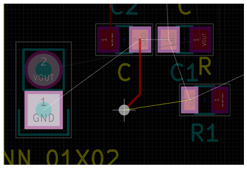
 
*Place the VIA in the empty area between the CONN_01x02 and the capacitor by left clicking. Finally left click on the GND pad of the CONN_01x02 to complete the trace.*

You may notice in the layer pallet that we are now on the B.Cu layer (back copper). The VIA connected the top layer trace to the bottom layer trace! Pressing V again will switch to the front layer or you can click it in the layer pallet. 

The openGL router has a few cool modes.

*Preferences -> Interactive routing*

There are several modes listed. Walkaround attempts to go around an obstacle on the board to the trace you are making. Shove pushes the obstacle(s) so that you can put the trace where you want it. Try both out on this board to see how they work. They are both very useful. **Generally I find shove more useful.**

We have done two traces together. Go ahead and route the rest of the traces. You can use VIAs to go to the other side of the board to avoid crossing one trace with another. Typically you will need two VIAs, on to go to the backside and one to come back to the front side. Do not be afraid to redo the routing of traces as you go. 

*Continue to route the board.*

If you mess up you can exit placing traces by hitting escape until the cross hair goes away. Then you can delete traces with the delete key by hovering over them. My finished routing looks like this:

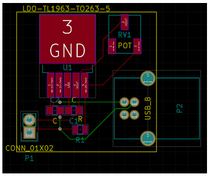
 
The last thing to do is to add a ground plane to the backside of the board. 

*Select the B.Cu layer in the layer pallet*

*Change the grid to 25 mil*

*Place->Zone, left click near a corner of your board inside the edge cuts of the board*

The Copper Zone Properties dialog will appear:

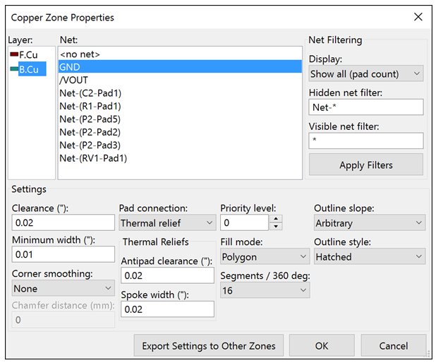
 
The defaults here are okay. 

*Draw a box inside the edge cuts of your board and double click when you return to the vortex from which you started.*

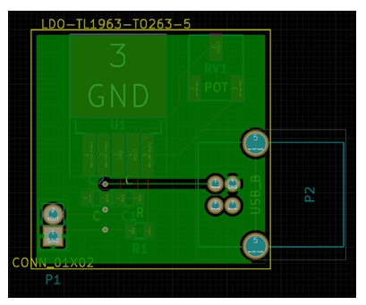
 
You should get something like the above (though it may not be filled in yet). If you are like me you will have some silkscreen markings outside of the edges of the board or overlapping with pads. 

*Move them with M to somewhere nice on your design.*

We are now done our PCB design. We will now check that the design is finished the design rules checker and then create the files to send out to the manufacturer. First save the board.

*File-> Save*

To run the design rules checker:

*Tools->DRC, Start DRC*

**Look at the Problems and Unconnected tabs.** In my case I had one set of unconnected nodes on the USB_B connector. You may have noticed the unrouted airline on the last image of my PCB design. I know these are both to the shield of the USB cable connector and I do not need to route them. If you choose to that is fine also, it does not hurt. 

To make the files for fabrication:

*File->Plot, match the checked layers in the image below, and check Use Protel filename extensions in the Gerber Options area*

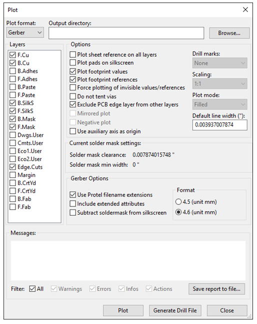
 
These are the layers OSHPark will need to make the board. (Update: OSHPark will now accept the .kicad_pcb format; however most vendors only accept Gerbers so the procedure below is still useful to know).

*Click Plot to create the files*

We also have to generate a drill file. These are for the holes through the PCB namely VIAs and the through-hole parts on this board like the USB connector. 

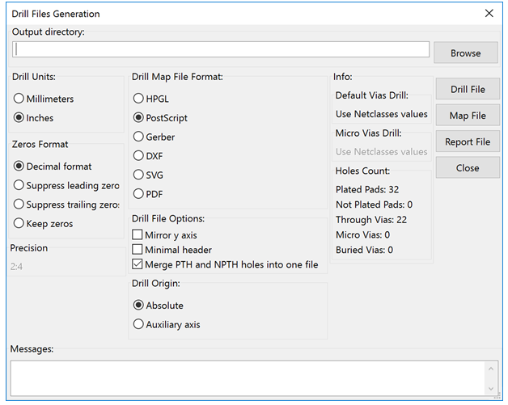

*Click Generate Drill File, the options should match the image below as the default*
 
*Click Drill File to create the file.*

The files we just created are in the project directory. All you have to do to have the PCB made is to zip them together and give them to a manufacturer to make your design!

## Inspecting the output files:
Before we send out the design we can look at these files, called Gerbers, with a viewer.

KiCAD has a viewer built in called Gerbview. Gerbv is another free viewer some may prefer. 

For this tutorial we will use Gerbview. We will run Gerbview from the main KiCAD window.

*Tools-> Run Gerbview*

*File-> Load Gerber File, select all the files in your project directory and click OK*

*File-> Load Excellon Drill File, select the drill file and click OK*

Your gerber files are now loaded. You can zoom in and out and inspect that they look right. You can hide layers by unchecking them from the layer pallet at the right hand side of the tool.

## Summary of workflow:

 *Create a schematic of the circuit you wish to design with eeSchema, creating any symbols you find you need as you make the schematic
 *Annotate the schematic
 *Create any new footprints your components may require
 *Assign footprints to the components with Cvpcb
 *Export the netlist
 *Use PCBnew to read the netlist
 *Arrange the footprints to minimize the messiness of the ratsnest
 *Place a board edge around your parts
 *Create the traces, VIAs and zones needed to complete the design
 *Run a design rules check
 *Export gerber and drill files for fabrication

Finally if you want to be very everything is right with your files you can use gerbview or gerbv to examine your output files before you send them off to be made. 

