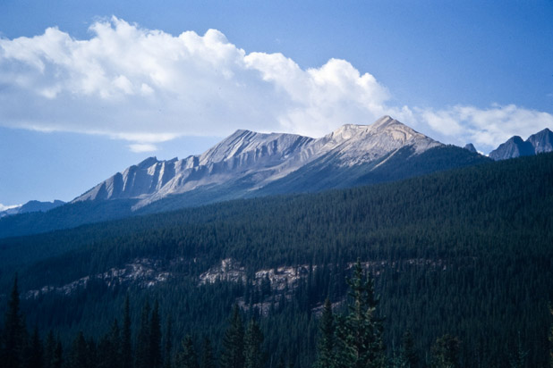
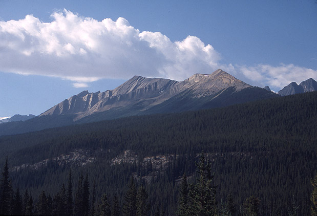
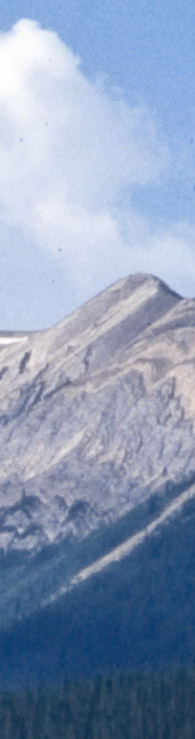
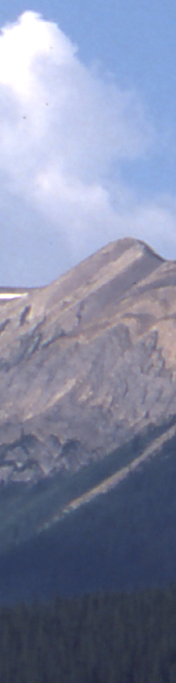

###Simple Rapid Slide Digitizer</h3> 
    

A lot of people have old slide collections. Pretty much anyone who was serious about photography more than 10 years ago probably has at least a few boxes of slides. I have about two shoe boxes full and my father has a lot more.   

For a long time I have thought how can I get my slides all digitized so that I can not only have easy access to them but also in case they mold or fade. I've owned slide scanners both flatbed and dedicated and while they work well enough they aren't exactly what I'd call speedy. Using such a system to copy <em>thousands</em> of slides is daunting to say the least.  

I had looked into this question and found some options, such as Nikon's SF-210 slide feeder, but the cost was staggering: 1000s of dollars. You can make a decent scan for 60-80 dollars using a flatbed but it is slow. To do it quickly or at least without a lot of work  costs more than I could afford...

Luckily, one day I thought why don't I just take pictures of my slides? Then I though of how to backlight them: with a slide projector of course! Slide projectors cost next to nothing these days. The one I used was free. I just pulled out the optics, put in a plastic diffuser and bam it was ready to go.   

Now I admit the system I designed requires two really expensive parts: a nice macro lens and a decent digital SLR to use with said lens, but I think a lot of photographers who would have had slide collections also have these! So the cost to them is low.  (Total cost to me was under 10 dollars, and I can reuse the parts as this is just a breadboard design).

To automate the setup, I used an AVRTiny2313 microcontroller attached to two small relays. The relays are tied to the cable release (2.5 mm stereo jack) for the Canon 400D DSLR and the remote advance pins of the slide projector. (Kodak Ektagraphic II). The whole thing can run at about 1 Hz.      

As you can see above the simplified schematic is  a very simple design.

In my system the timing and slide number are programmed in via a 8 pin dip switch. Using the system requires tuning the timing for the slide projector chosen, then manually focusing on the slide and manually setting the exposure so that results will be uniform across all the slides. (Update: I am finding using aperture priority helps compensate for slide density better, but manual focus is essential so that the system remains in sync, there is a risk if you have very black slides that using Av will throw off the sync depending on what timing you set). Use of a high f-number is recommended to help with DOF (I chose f11 and shot with RAW to give better exposure latitude).    
  
Once that is done, you just set the number of slides and push go. You can see how it works in the video below. 

  <object type="application/x-shockwave-flash" width="400" height="300" data="http://www.flickr.com/apps/video/stewart.swf?v=71377" classid="clsid:D27CDB6E-AE6D-11cf-96B8-444553540000"> <param name="flashvars" value="intl_lang=en-us&photo_secret=898d35f5e5&photo_id=4149018287"></param> <param name="movie" value="http://www.flickr.com/apps/video/stewart.swf?v=71377"></param> <param name="bgcolor" value="#000000"></param> <param name="allowFullScreen" value="true"></param><embed type="application/x-shockwave-flash" src="http://www.flickr.com/apps/video/stewart.swf?v=71377" bgcolor="#000000" allowfullscreen="true" flashvars="intl_lang=en-us&photo_secret=898d35f5e5&photo_id=4149018287" height="300" width="400"></embed></object>  
  
Onto the results! Here is a comparison of a random slide from my 2003 cross country road trip using the slide copier and my Canon 8400F  scanner.

Both the full composition and crops are shown bellow.
Auto Slide Copier Result (click for full size):

  

Canon 8400F Scanner Result (click for full size):

  <table width="450" border="0">
    <tr >
      <td valign="top">Slide Copier Crop: </td>
      <td valign="top">Canon 8400F Crop: </td>
    </tr>
    
  </table>

The rapid slide copier really does  quite well. When you consider that the 8400F takes about 60 seconds to scan one positive at 3200 DPI (2.5 minutes if you have FARE on), the 1 second needed take the automated copy is all the more impressive. Try to ignore the differences in color as these are mostly due to the choice of white balance for the two methods and could be changed.   

I used Adobe Lightroom to convert the RAW file from my camera with only the &quot;autotone&quot; adjustment applied. I used autotone in the Canon TWAIN driver as well. The white balance of the 400D was set to custom using a blank frame of the projector light as the custom source. The white balance for the Canon 8400F was set to automatic.

I feel like they both do a good enough job, each way has advantages, but for rapid digitization of a whole collection this simple auto copier is great, simply because of the fact that was used to take an <em>hour</em> now takes a <em>minute</em>. The most time consuming part is loading the carousel.   

Update: If you want more details I have written them up [here](./slidedigitizerdetails.html)
